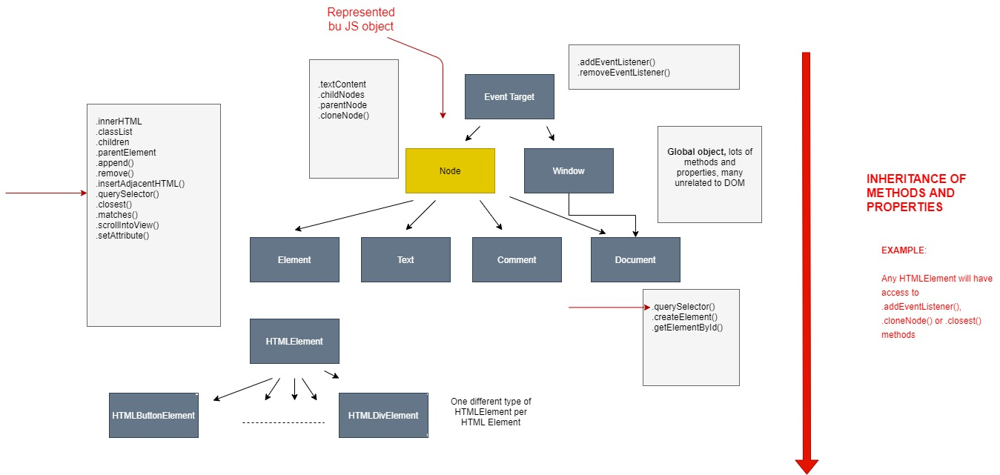

# HOW THE DOM REALLY WORKS

## **_Review: What is the DOM?_**

The DOM:

- Allows us to make JavaScript interact with the browser
- We can write JavaScript to create, modify, and delete HTML elements; set styles, classes and attributes; and listen and respond to events
- DOM tree is generated from an HTML document, which we can then interact with
- DOM is a very complex API that contains lots of methods and properties to interact with the DOM tree

```
.querySelector() / .addAddEventListener() / .createElement() /
.innertHTML / .textContent / .children / etc...
```

## **_How The DOM API is Organized Behind the Scnenes_**



## MDN Documentation

[MDN Web Docs](https://developer.mozilla.org/en-US/)
